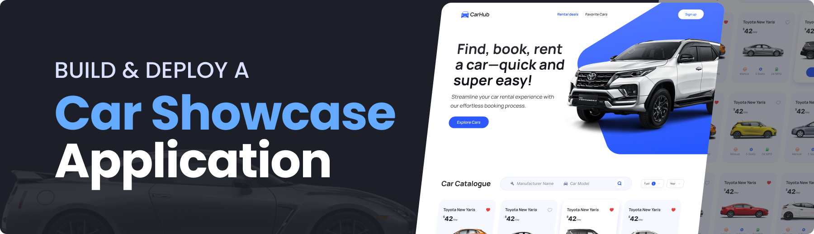

<h1 align="center"><b>🏎️ Car Showcase Using Next.js ⚡🚗💨</b></h1>



## 🚀 Project Highlights  

- **Built with Next.js, TypeScript, and Tailwind CSS** for a modern, responsive UI.  
- **Advanced Filtering & Search System** to explore cars by model, manufacturer, year, fuel type, etc.  
- **Server-Side Rendering (SSR)** for improved performance and seamless user experience.  
- **Pagination Support** for easy browsing of large datasets.  
- **Metadata Optimization & SEO** for better search engine rankings.  
- **TypeScript Integration** for strong typing and code reliability.  
- **Fully Responsive Design** ensuring compatibility across all devices.  
- **Fetching Car Data from API** to display real-time car information.  
- **Step-by-Step Video Tutorial** available on the JavaScript Mastery YouTube channel.  
- **Community Support** via an active Discord server with 27k+ members.  

## 🛠️ Quick Start

Follow these steps to set up the project locally on your machine.

**Prerequisites**

Make sure you have the following installed on your machine:

- [Git](https://git-scm.com/)
- [Node.js](https://nodejs.org/en)
- [npm](https://www.npmjs.com/) (Node Package Manager)

**Cloning the Repository**

```bash
git clone https://github.com/adrianhajdin/project_next13_car_showcase.git
cd project_next13_car_showcase
```

**Installation**

Install the project dependencies using npm:

```bash
npm install
```

**Set Up Environment Variables**

Create a new file named `.env` in the root of your project and add the following content:

```env
NEXT_PUBLIC_RAPID_API_KEY=
NEXT_PUBLIC_IMAGIN_API_KEY=
```

Replace the placeholder values with your actual credentials. You can obtain these credentials by signing up on the corresponding websites from [Rapid API](https://www.youtube.com/redirect?event=video_description&redir_token=QUFFLUhqbmI1TlE1NHFGZ1JLdHU3dnAxSTU5a2R5UUM4QXxBQ3Jtc0tsUDY0aW8xMFhUZVdxMUNzSUlKUExRTG5UaDZoR3hWVFprN2tJV0k2dnk4MXo2NVFMVkk0NWhGS19Nd0g5cGRfN2JjcTdaSlJJRHJKYzlfT3lSS1M4TDVNVTV5Wl91c1lIR2VPZUYzbHJ2Tll2QkJ0aw&q=https%3A%2F%2Frapidapi.com%2Fapininjas%2Fapi%2Fcars-by-api-ninjas%3Futm_source%3Dyoutube.com%2FJavaScriptMastery%26utm_medium%3Dreferral%26utm_campaign%3DDevRel&v=pUNSHPyVryU) to [Imagin Cars](https://www.imagin.studio/solutions/api)

**Running the Project**

```bash
npm run dev
```

Open [http://localhost:3000](http://localhost:3000) in your browser to view the project.

## Still need help?
Open an issue on our GitHub repository, and we will help you as soon as possible.

Enjoy exploring and extending this project! Feel free to contribute and suggest improvements.

## Contact

If you want to contact me you can reach me at [Twitter](https://x.com/SandhitK).

## Developer
<table>
    <tr align="center">
        <td>
        Sandhit Karmakar
        <p align="center">
            
        </p>
            <p align="center">
                <a href = "https://github.com/Sandhit06">
                    
                </a>
                <a href = "https://www.linkedin.com/in/sandhit-karmakar/" target="_blank">
                    
                </a>
                <a href = "mailto:sandhitkarmakar@gmail.com" target="_blank">
                    
                </a>
            </p>
        </td>
    </tr>
</table>

<p align="center">
    Made with ❤️ by <a href="https://github.com/Sandhit06">Sandhit Karmakar</a>
</p>
